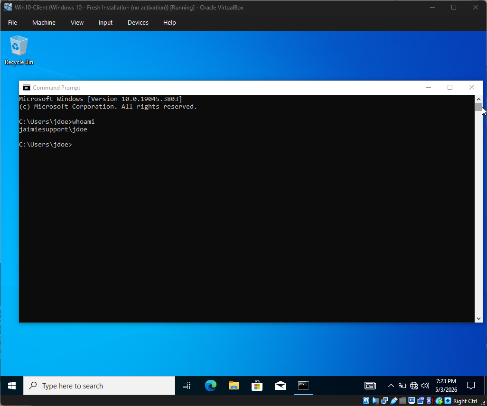

---

# 💻 Windows Server 2022: Automated & Secure AD Home Lab

---

# 📑 Table of Contents
* [🔹 Overview](#-overview)
* [🌐 Phase 1: Virtual Network Configuration](#-phase-1--virtual-network--static-ip-configuration)
* [🏢 Phase 2: Active Directory Deployment](#-phase-2--active-directory-deployment)
* [🧠 Phase 3: DNS Troubleshooting](#-phase-3--dns-troubleshooting--resolution)
* [✅ Phase 4: Domain Join & Validation](#-phase-4--domain-validation--domain-join)
* [⚡ Phase 5: PowerShell Automation](#-phase-5--powershell-automation-the-1-second-setup)
* [🔐 Phase 6: Security Hardening (GPO)](#-phase-6--security-hardening--gpo)
* [📊 Phase 7: SOC Monitoring (Audit Logs)](#-phase-7--soc-monitoring--audit-logs)
* [🚀 Skills Demonstrated](#-skills-demonstrated)

# 🔹 Overview
This lab demonstrates the evolution from basic infrastructure setup to **Advanced System Administration**. I built a virtualized enterprise environment that manages identities, uses **PowerShell automation** to provision users, and enforces a security baseline via **Group Policy Objects (GPOs)**.

### Key Project Components:
* **Infrastructure:** Domain Controller promotion and internal virtual networking.
* **Automation:** Using PowerShell to bulk-create users from a CSV file.
* **Hardening:** Implementing GPOs to restrict high-risk tools like CMD.
* **Auditing:** Analyzing Windows Event Logs (Event ID 4624) to monitor network access.

---

# 🌐 Phase 1 – Virtual Network & Static IP Configuration
To simulate a real-world enterprise environment, I isolated the VMs within a private internal network (`10.0.0.0/24`).

### Network Isolation

*Configuring VirtualBox internal networking for an isolated enterprise environment.*

### Static IP Assignment

*Configuring the Domain Controller at `10.0.0.1` and the Client at `10.0.0.2`.*

---

# 🏢 Phase 2 – Active Directory Deployment
I installed **Active Directory Domain Services (AD DS)** and promoted the server to a Domain Controller for the forest `jaimiesupport.local`.

*Verifying successful Domain Controller promotion and administrative authentication.*

---

# 🧠 Phase 3 – DNS Troubleshooting & Resolution
During the domain-join process, I encountered a communication failure. I performed root cause analysis and identified a DNS mismatch.

*Initial domain join failure caused by the client not pointing to the DC for DNS.*

*Resolution: Manually updating client DNS settings to `10.0.0.1`.*

---

# ✅ Phase 4 – Domain Validation & Domain Join
With DNS resolved, the Windows 10 workstation successfully joined the domain.

*Verifying workstation domain membership and managing initial user accounts.*

*First successful domain login and verification using the `whoami` command.*

---

# ⚡ Phase 5 – PowerShell Automation (The 1-Second Setup)
To scale the environment, I developed a PowerShell script to automate user onboarding from a CSV file, ensuring standardized account creation.

*Executing the script to provision accounts for Jaimie, Alex, and Jordan.*

*The `Automated_Users` OU successfully populated via automation.*

---

# 🔐 Phase 6 – Security Hardening & GPO
I implemented **Identity and Access Management (IAM)** restrictions to harden the workstations. I created a GPO to disable Command Prompt access for all users in the `Automated_Users` OU.

*Verification: The security policy successfully blocks unauthorized tool access on the Win10 Client.*

---

# 📊 Phase 7 – SOC Monitoring & Audit Logs
Finally, I verified the "visibility" of the lab by auditing logon events in the **Windows Event Viewer**.

*Filtering for **Event ID 4624** to confirm that "Alex" successfully authenticated.*

---

# 🚀 Skills Demonstrated
* **System Admin:** DC Promotion, DNS Troubleshooting, GPO Management.
* **Automation:** PowerShell Scripting, CSV Data Integration.
* **Cybersecurity:** Workstation Hardening, Audit Logging, IAM Principles.
* **Networking:** IPv4 Subnetting, Virtual Network Isolation.

# 📌 Final Note
This project represents a full-cycle IT task: **Build, Automate, Secure, and Monitor.** It serves as a comprehensive proof of concept for modern, secure Windows Administration.
