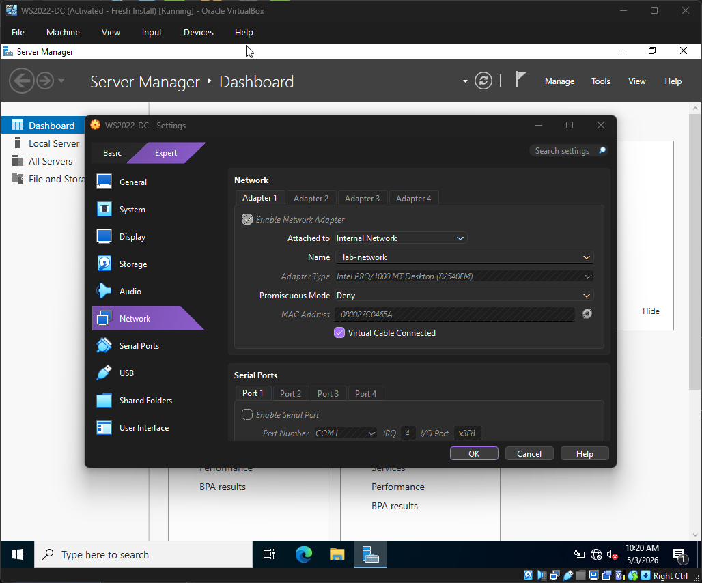
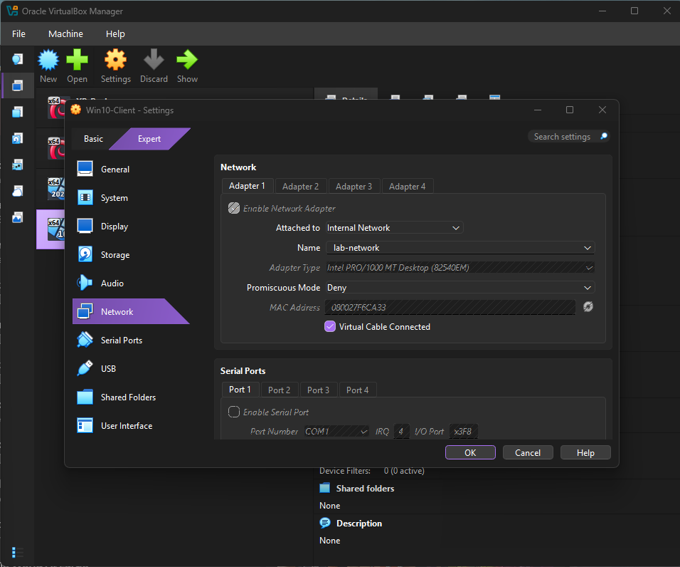
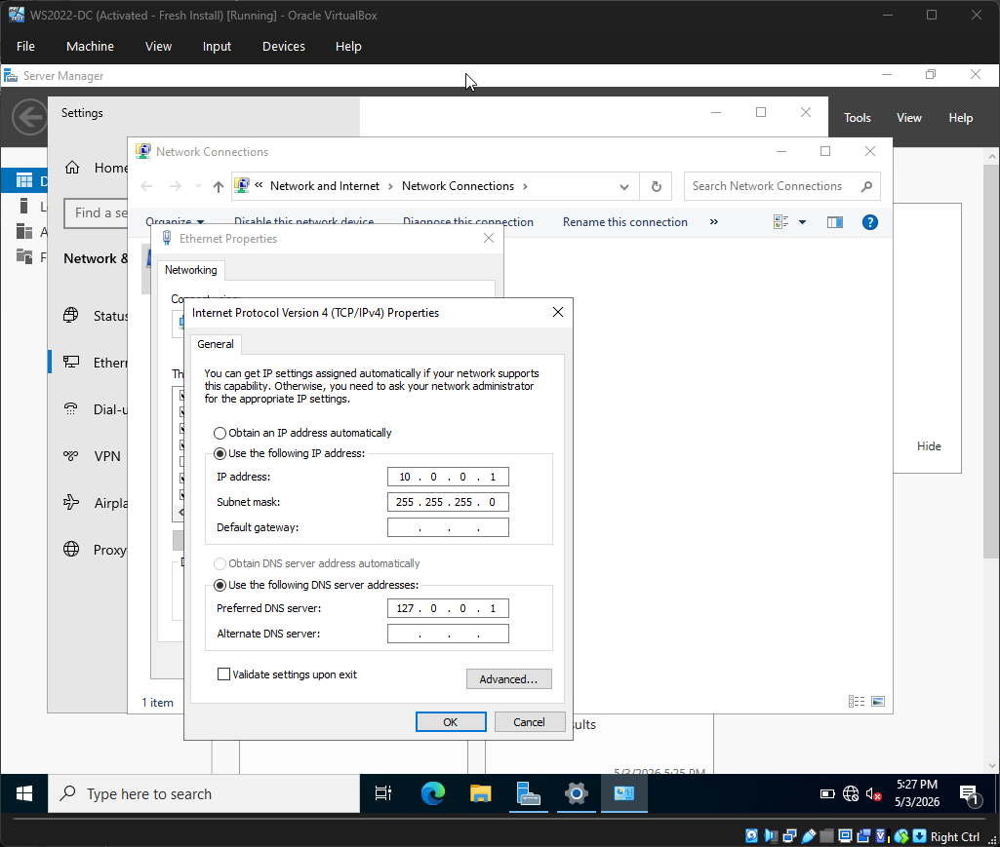
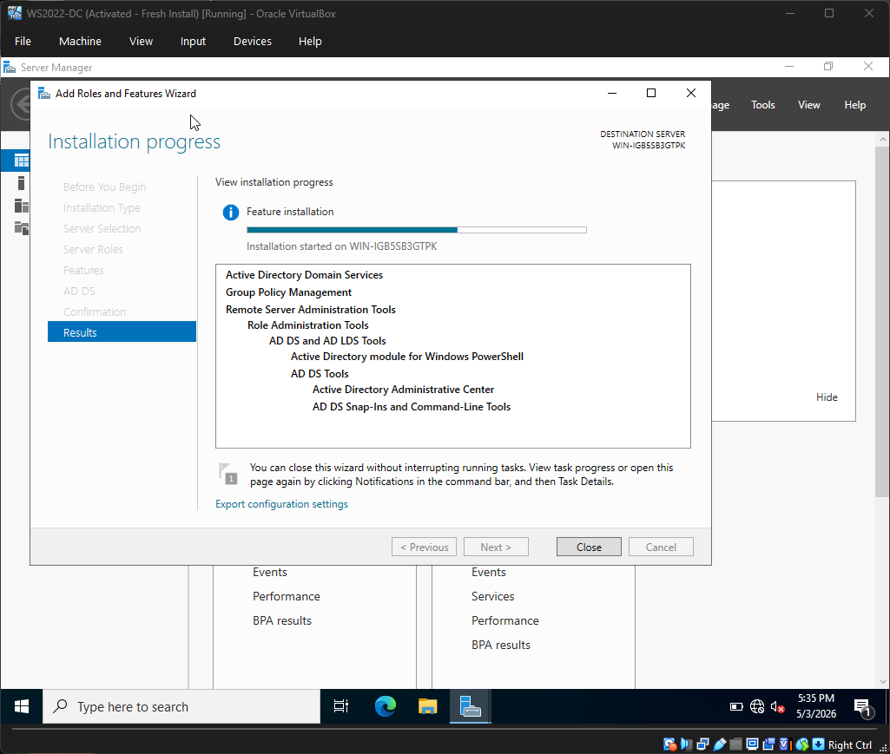
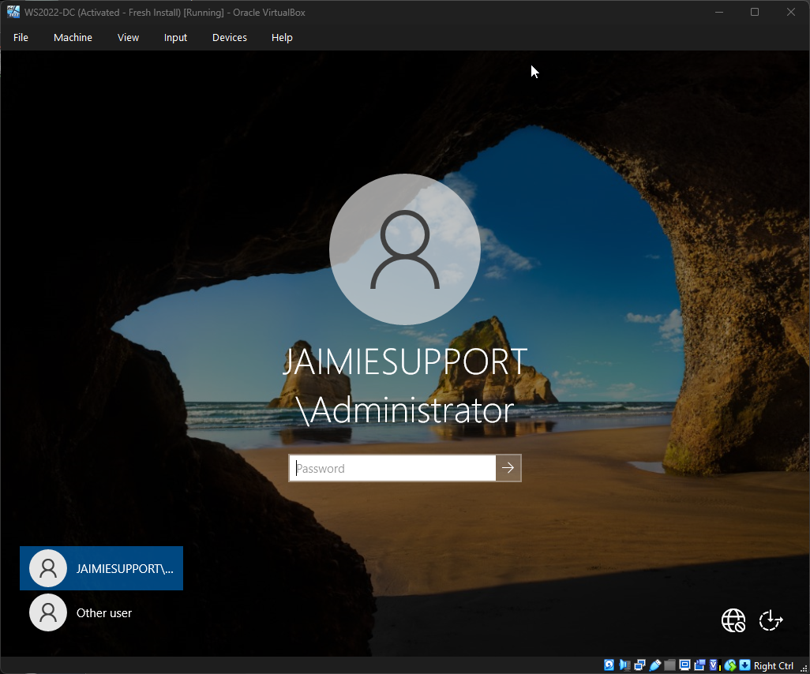
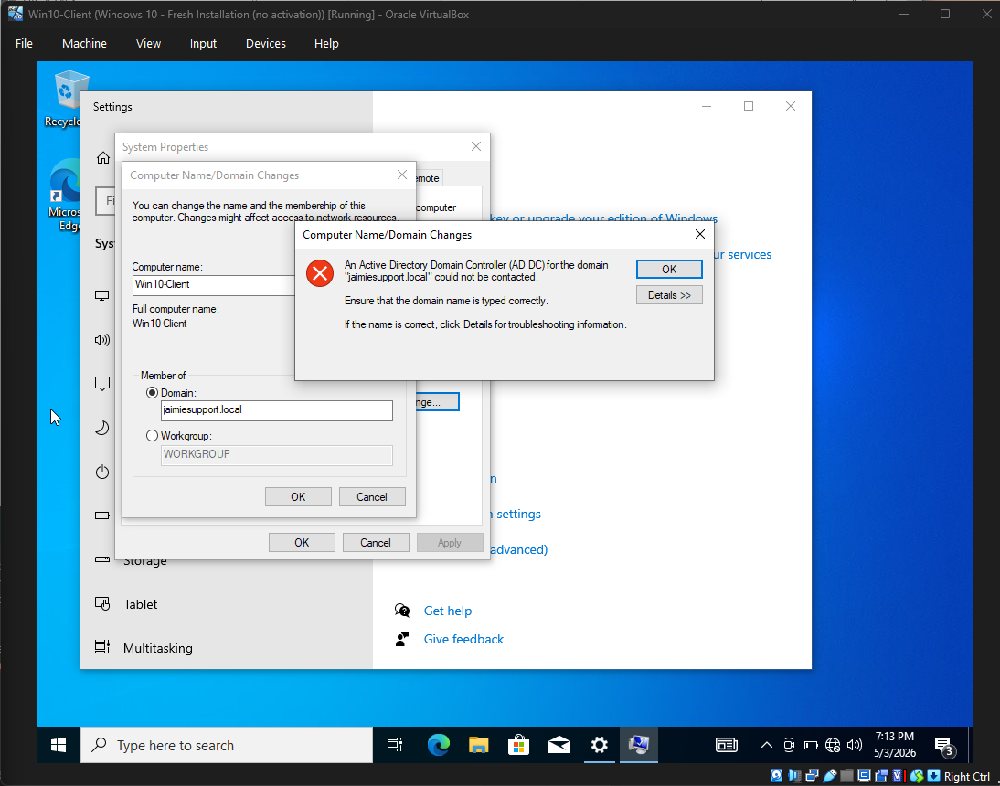
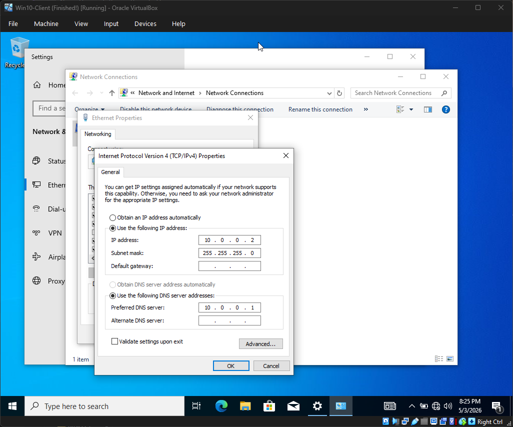
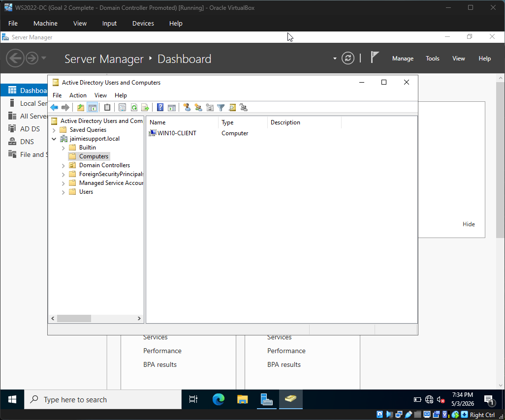
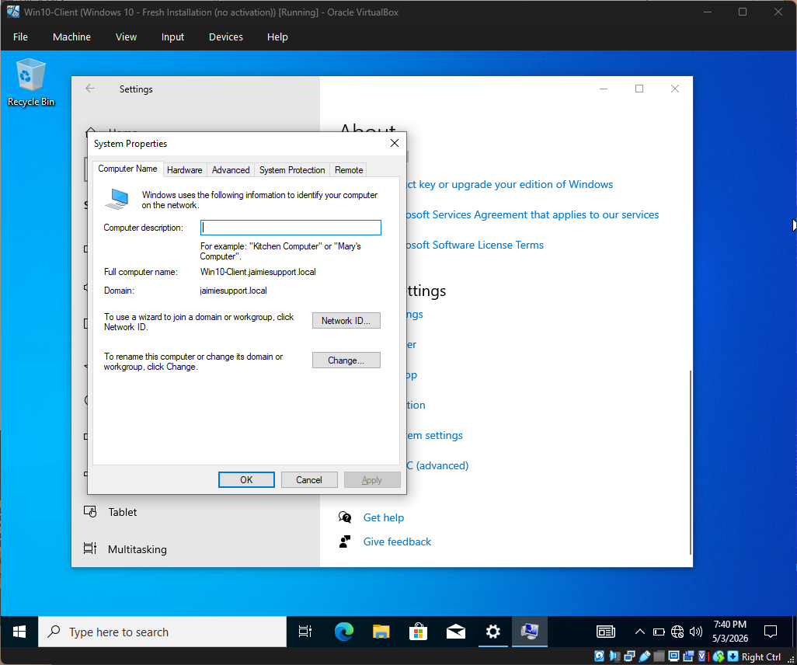
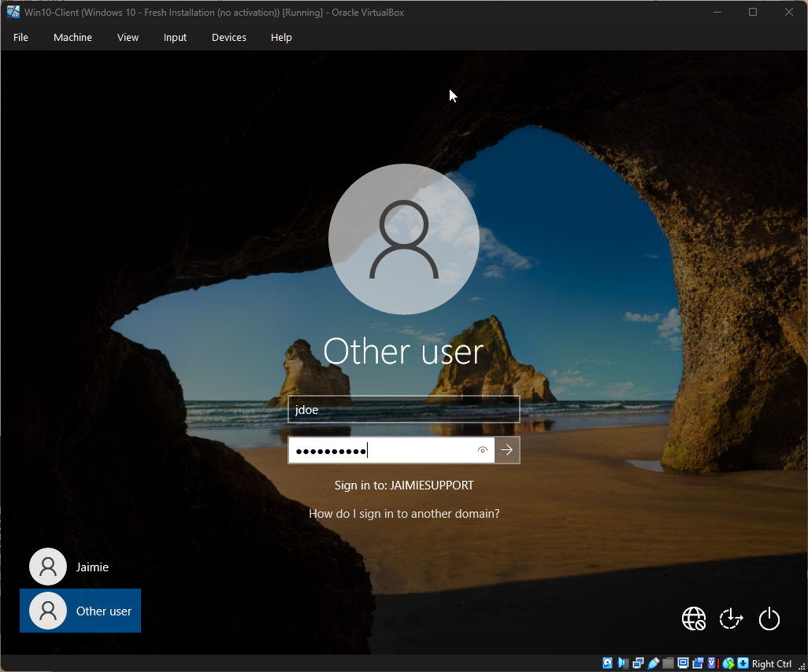

# Windows Server 2022 & Active Directory Home Lab

## 📋 Project Overview
This project involved building a virtualized enterprise network environment. I successfully deployed a Domain Controller to manage centralized identity and authentication for a Windows 10 workstation.

## 🛠️ Environment Details
- **Hypervisor:** Oracle VirtualBox
- **Network Type:** Internal Network (`lab-network`)
- **Domain Name:** `jaimiesupport.local`
- **Server IP:** `10.0.0.1`
- **Workstation IP:** `10.0.0.2`

Phase 1: Network Configuration
To simulate a real corporate environment, I isolated the VMs from the internet.

VirtualBox Settings: Both VMs were set to an Internal Network named lab-network.  

Static IP Assignment: I manually configured the Server to 10.0.0.1 and the Client to 10.0.0.2 to ensure consistent communication.  

Phase 2: Domain Controller Promotion
I installed Active Directory Domain Services (AD DS) on the Windows Server 2022 VM.  

Forest Name: jaimiesupport.local

  

Result: The server was promoted to a Domain Controller, and the DNS role was automatically configured.  

## 🧠 Lessons Learned & Troubleshooting
### The DNS Handshake
The only small challenge was a connection failure when joining the Windows 10 Client to the domain. I diagnosed this as a DNS resolution issue. By manually configuring the Client's IPv4 settings to point to the Server's IP as the primary DNS, I established a successful "handshake" between the machines.

## 🖼️ Success Evidence
### 1. Active Directory User Created
I created a user account for **John Doe** (`jdoe`) within the AD DS database.

### 2. Domain Membership Verified
The workstation successfully joined the `jaimiesupport.local` domain.

### 3. Successful Authentication
Logged in as `jdoe` and verified identity using the `whoami` command.

