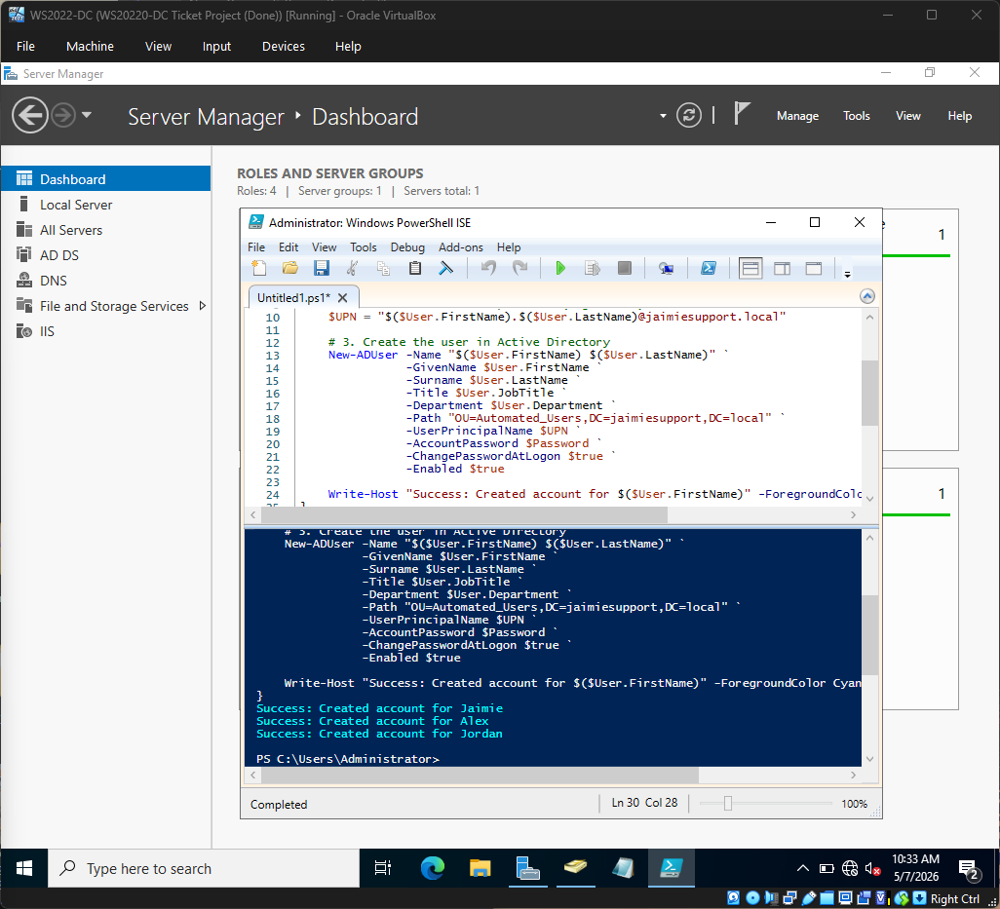
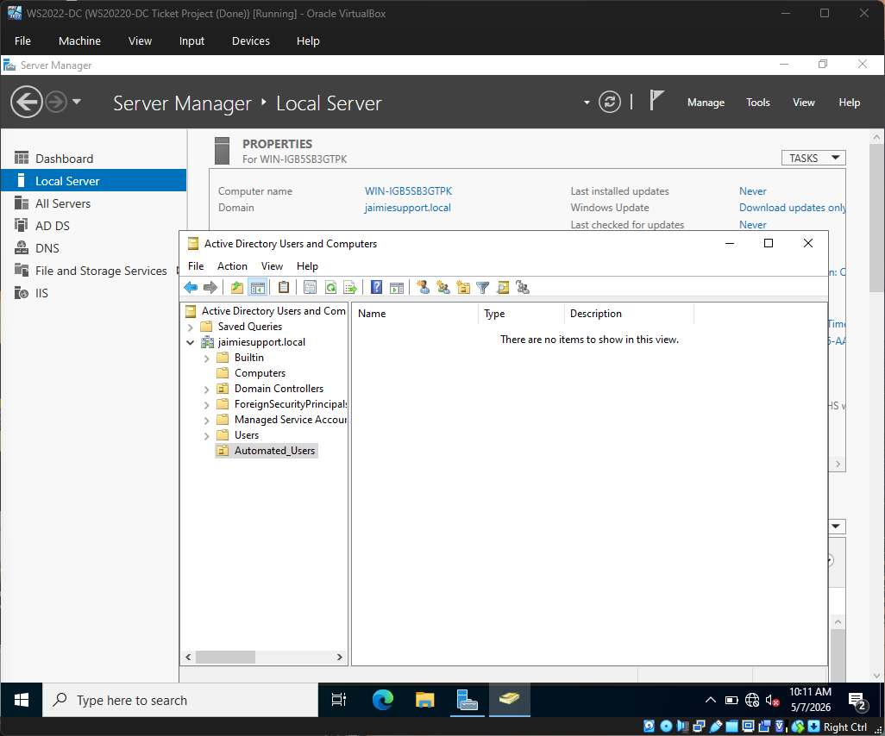
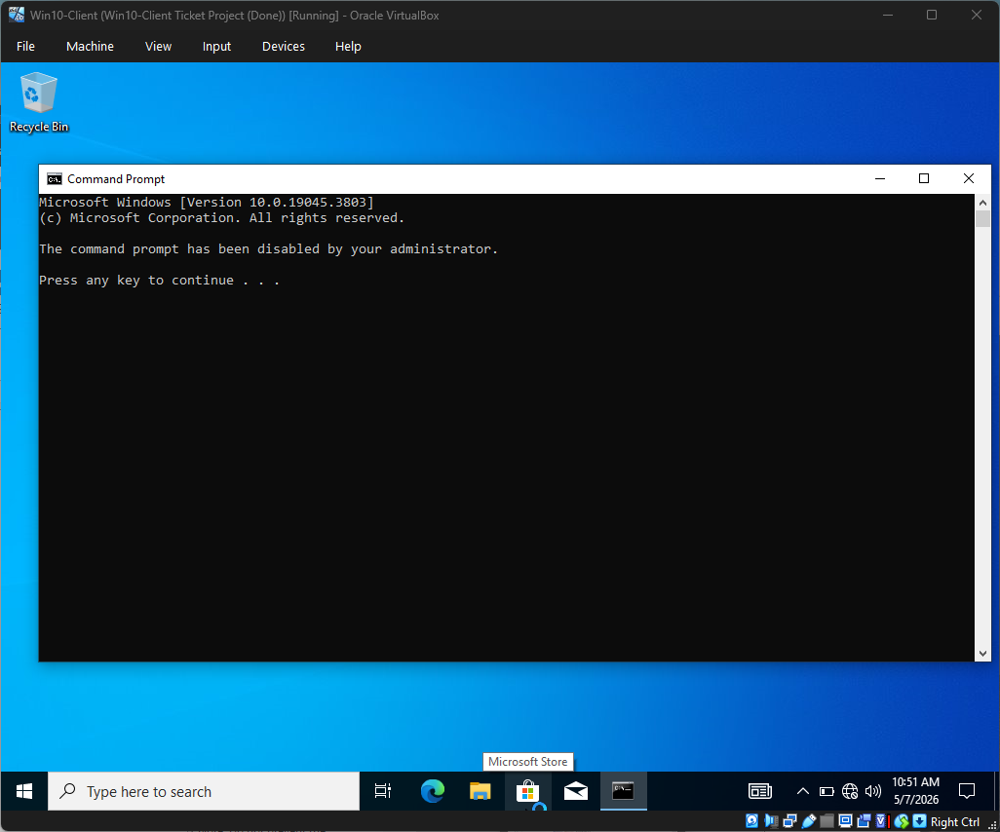
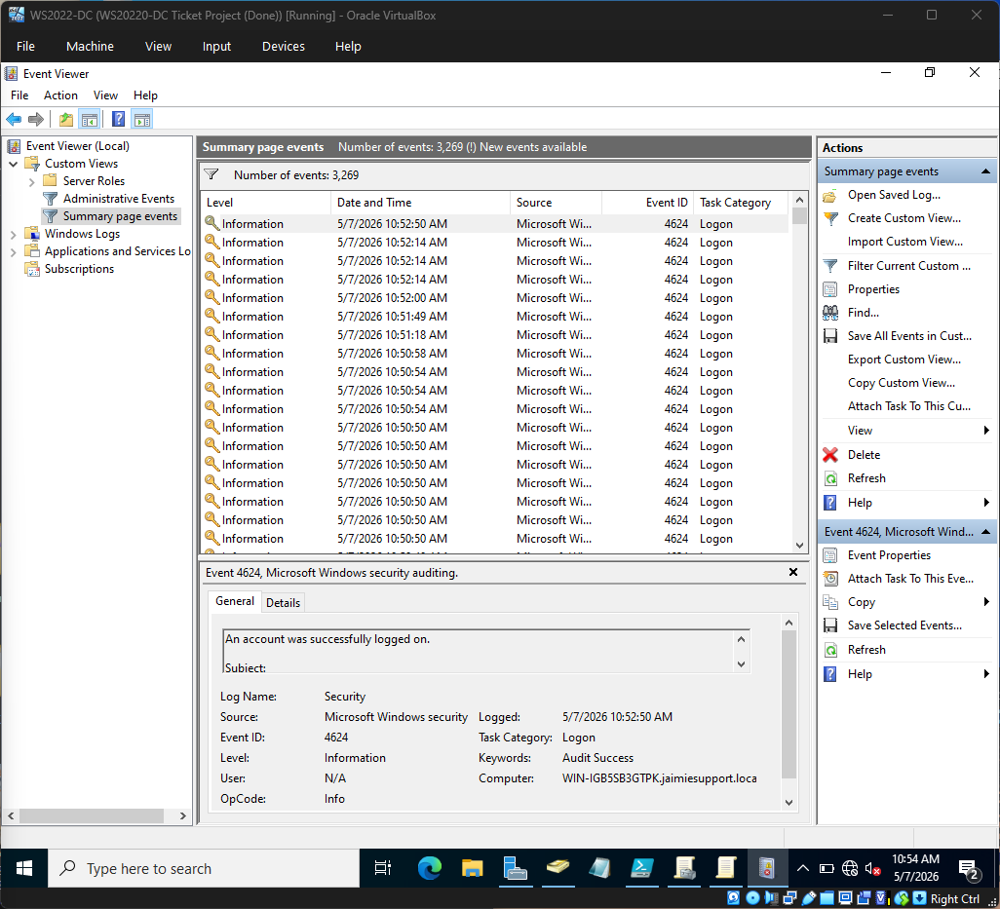

# 💻 Windows Server 2022: Automated & Secure AD Home Lab

---

# 🔹 Overview
This lab demonstrates the evolution from basic infrastructure setup to **Advanced System Administration**. I built a virtualized enterprise environment that not only manages identities but also uses **PowerShell automation** to provision users and **Group Policy Objects (GPOs)** to enforce a security baseline.

### Key Project Components:
* **Automated Onboarding:** Using PowerShell to bulk-create users from a CSV file.
* **Workstation Hardening:** Implementing GPOs to restrict high-risk tools like CMD.
* **SOC Monitoring:** Analyzing Windows Event Logs (Event ID 4624) to audit successful logons.

---

# 🔹 Core Skills Demonstrated
* **Active Directory:** Forest/Domain promotion, OU management, and User Lifecycle management.
* **Automation:** Scripting with PowerShell ISE and CSV data integration.
* **Cybersecurity:** GPO hardening, principle of least privilege, and audit logging.
* **Technical Support:** DNS troubleshooting, static IP routing, and domain-join procedures.

---

# 🌐 Phase 1 & 2 – Infrastructure & AD Deployment
I established a private internal network (`10.0.0.0/24`) to isolate the enterprise environment.

| Device | Role | IP Address |
| :--- | :--- | :--- |
| **DC-2022** | Domain Controller / DNS | `10.0.0.1` |
| **WIN10-CLI** | Workstation | `10.0.0.2` |

*Note: Initial setup included configuring static IPs, promoting the server to a Domain Controller for `jaimiesupport.local`, and resolving DNS communication issues to allow the Windows 10 client to join the domain.*

---

# ⚡ Phase 3 – PowerShell Automation (The 1-Second Setup)
To simulate a real-world bulk hiring scenario, I developed a PowerShell script that imports employee data from a CSV and automatically provisions accounts with secure default settings.

### User Automation Script

*Executing the onboard script to provision Jaimie, Alex, and Jordan.*

### Organized Directory Structure

*The `Automated_Users` Organizational Unit (OU) successfully populated via script.*

---

# 🔐 Phase 4 – Security Hardening & GPO
Once the users were created, I implemented **Identity and Access Management (IAM)** restrictions to harden the workstations against internal threats.

### Security Implementation:
1.  **GPO Creation:** Developed a "Security_Baseline" policy.
2.  **Restriction:** Disabled Command Prompt (CMD) access for all users in the `Automated_Users` OU.
3.  **Result:** Unauthorized command-line access is blocked, significantly reducing the system's attack surface.

### GPO Enforcement in Action

*Verification on the Windows 10 client showing the GPO successfully blocking CMD access.*

---

# 📊 Phase 5 – SOC Monitoring & Audit Logs
Using **Windows Event Viewer** on the Domain Controller, I verified that the system was accurately tracking and auditing user authentication events.

### Tracking Successful Logons

*Filtering for **Event ID 4624** to confirm that "Alex" successfully authenticated from the Win10 client.*

---

# 🧠 What I Learned
* **Scalability:** PowerShell automation is essential for managing enterprise-scale environments and reducing human error.
* **Governance:** Group Policy Objects (GPOs) provide a powerful, centralized way to enforce security baselines across an entire organization.
* **Visibility:** Monitoring Event Logs is the backbone of SOC operations, allowing for the detection of unauthorized access and compliance auditing.
* **Debugging:** Troubleshooting parameter binding errors in PowerShell reinforced the need for precise syntax and documentation.

---

# 🚀 Future Improvements
- [ ] **pfsense Integration:** Deploy a virtual firewall to monitor and filter outbound traffic.
- [ ] **SIEM Deployment:** Forward Event Logs to a tool like Splunk or ELK for real-time alerting.
- [ ] **Dynamic Provisioning:** Update the script to automatically assign Security Groups based on the user's Department field.

---

# 📌 Notes
This project represents a full-cycle IT administrative task: **Build, Automate, Secure, and Monitor.** It serves as a proof of concept for modern, secure Windows Administration.
